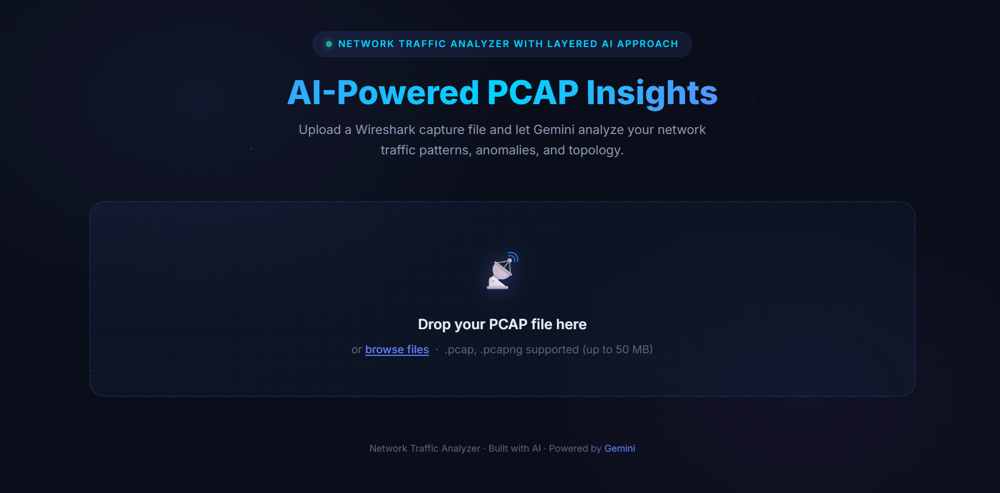
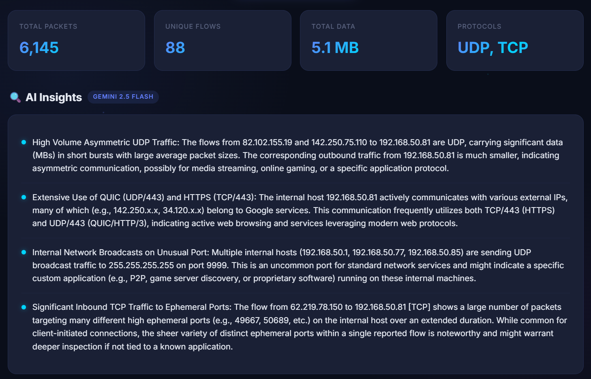
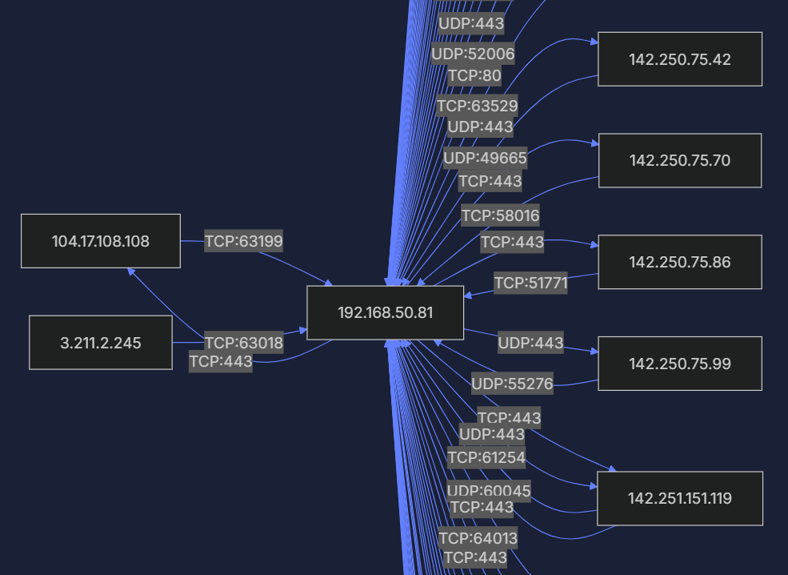

# Network Traffic Analyzer with Layered AI Approach

A sophisticated, AI-powered network traffic analysis tool built around a structured **3-Layer Agentic Architecture**. It processes raw Wireshark capture files (`.pcap`/`.pcapng`), extracts network flows, and utilizes Google's Gemini 2.5 Flash model to generate human-readable security insights and Mermaid.js network topology diagrams.

## ✨ Features
*   **Intelligent PCAP Parsing:** Efficiently reads and process `.pcap` files using `scapy`, summarizing raw packets into logical communication flows.
*   **AI-Powered Insights:** Leverages Google Gemini 2.5 Flash to automatically interpret network behaviors, identify anomalies, and flag potential security concerns.
*   **Visual Network Topology:** Dynamically generates interactive network flow diagrams using Mermaid.js based directly on the captured traffic.
*   **Modern Web UI:** Features a sleek, dark-themed responsive frontend with drag-and-drop file upload capabilities.
*   **3-Layer Autonomous Architecture:** The codebase strictly adheres to a structured AI engineering pattern:
    *   **Layer 1: Directives:** The "What" – Markdown files defining the goals.
    *   **Layer 2: Orchestration:** The "How" – The AI's decision-making and planning logic.
    *   **Layer 3: Execution:** The "Action" – The resulting, working Python/JS scripts.

---

## 📸 Gallery
<div align="center">
  <h3>1. Main Dashboard</h3>
  
  <br/><br/>
  <h3>2. AI Traffic Analysis & Insights</h3>
  
  <br/><br/>
  <h3>3. Dynamically Generated Mermaid Network Diagram</h3>
  
</div>

---

## 🚀 Quick Start & Installation

### 1. Clone the repository
```bash
git clone https://github.com/your-username/network-traffic-analyzer.git
cd network-traffic-analyzer
```

### 2. Set up the virtual environment
It is highly recommended to use a virtual environment to manage dependencies:
```bash
# Windows
python -m venv venv
venv\Scripts\activate

# macOS / Linux
python3 -m venv venv
source venv/bin/activate
```

### 3. Install requirements
Ensure you have `libpcap` installed on your system if you're on Linux (e.g., `sudo apt install libpcap-dev`). For Windows, Wireshark/Npcap installation usually provides the necessary drivers for Scapy.
```bash
pip install -r requirements.txt
```

### 4. Configure your Environment Variables
In the root directory of the project, locate or create the `.env` file and insert your Gemini API key:
```env
# .env 
GEMINI_API_KEY=your_actual_api_key_here
```

### 5. Generate Test Data (Optional)
If you do not have your own `.pcap` file ready, you can immediately generate a realistic 100-packet test file populated with HTTP, DNS, and simulated port-scanning traffic:
```bash
python execution/generate_sample_pcap.py
```
*This will create `sample.pcap` inside the `tmp/` directory.*

### 6. Run the Application
Start the Flask backend server:
```bash
python execution/app.py
```
Open your web browser and navigate to: **http://127.0.0.1:5000**

---

## 🧠 Project Architecture Breakdown
To read more about the core agentic reasoning behind this application's construction, refer to the root `AGENTS.md` file. The execution files built by the AI agent live entirely within the `/execution/` folder, directly solving the requirements outlined in the `/directives/` folder.

## 🛠️ Tech Stack
*   **Backend:** Python 3, Flask, Scapy
*   **AI / LLM:** Google `google-generativeai` SDK (Gemini 2.5 Flash)
*   **Frontend:** HTML5, Vanilla CSS (Dark Premium Theme), Vanilla JavaScript
*   **Visualizations:** Mermaid.js (via CDN)
